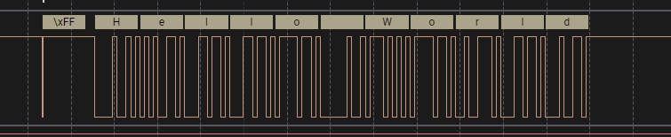
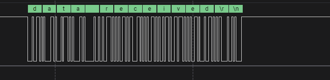
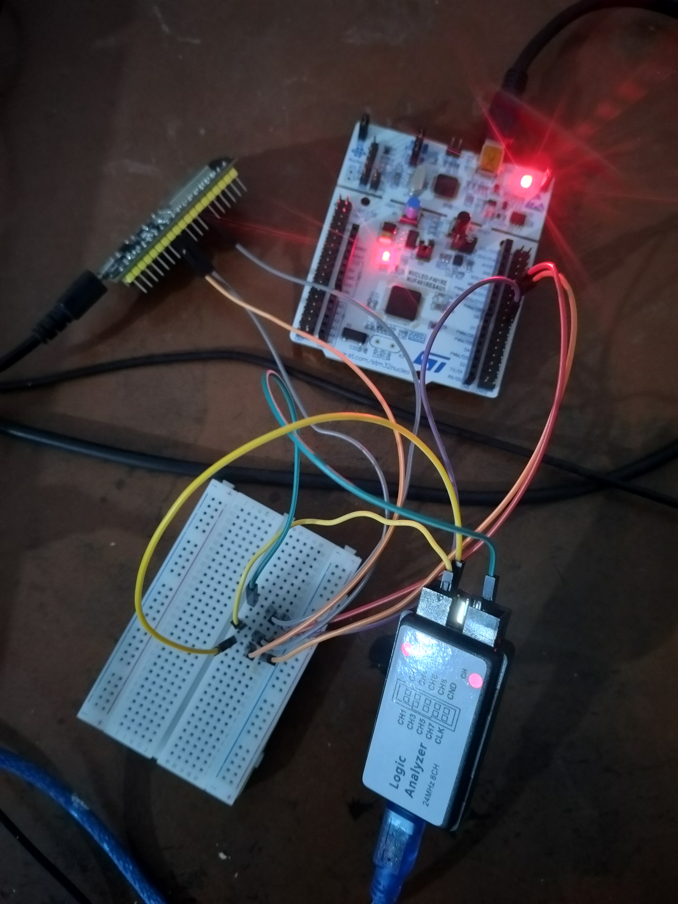
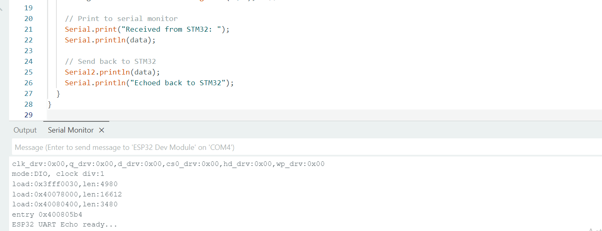
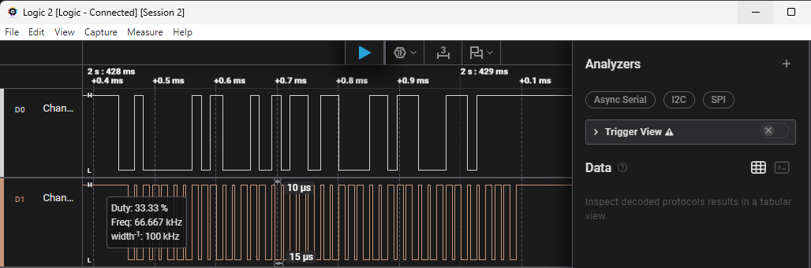
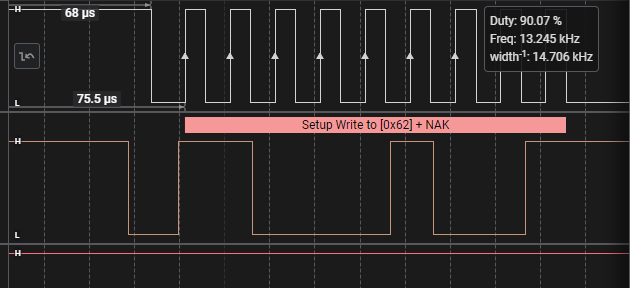

# STM32F401xx Peripheral Drivers

This repository contains custom peripheral drivers for the STM32F401xx microcontroller family, developed from scratch without using HAL libraries.

## Table of Contents
- [Overview](#overview)
- [Driver Architecture](#driver-architecture)
- [Register Categories](#register-categories)
- [GPIO Driver](#gpio-driver)
- [SPI Driver](#spi-driver)
- [I2C Driver](#i2c-driver)
- [USART Driver](#usart-driver)
- [RCC Driver](#rcc-driver)
- [EXTI Configuration](#exti-configuration)
- [Usage Examples](#usage-examples)
- [Project Structure](#project-structure)

## Overview

This project provides low-level drivers for STM32F401xx peripherals, offering direct register-level control with a clean API interface. All drivers are built without dependencies on ST's HAL libraries, providing maximum control and minimal overhead.

**Supported Peripherals:**
- **GPIO** (General Purpose Input/Output)
- **SPI** (Serial Peripheral Interface)
- **I2C** (Inter-Integrated Circuit)
- **USART** (Universal Synchronous/Asynchronous Receiver/Transmitter)
- **RCC** (Reset and Clock Control)
- **EXTI** (External Interrupt/Event Controller)

---

## Driver Architecture

### Register-Level Programming Philosophy
Each driver is built around direct manipulation of hardware registers, providing:
- **Maximum Performance**: No abstraction overhead
- **Complete Control**: Access to all peripheral features
- **Educational Value**: Understanding hardware operation
- **Minimal Footprint**: Optimized code size and RAM usage

### Common Driver Structure
All drivers follow a consistent pattern:
- **Configuration Structures**: Define peripheral parameters
- **Handle Structures**: Combine peripheral base address with configuration
- **Init/DeInit Functions**: Setup and reset peripherals
- **Operational Functions**: Perform data transfer and control
- **Interrupt Support**: Handle events and errors

---

## Register Categories

### Configuration Registers (CRx)
**Purpose**: Control how the peripheral operates
- Set operating modes (master/slave, input/output, etc.)
- Configure timing parameters (baud rates, clock phases)
- Enable/disable specific features
- Select alternate functions

**Example**: USART_CR1 enables transmitter/receiver, sets word length, configures parity

### Status Registers (SR)
**Purpose**: Provide real-time peripheral state information
- Indicate data availability (RXNE - Receive Not Empty)
- Show transmission status (TXE - Transmit Empty, TC - Transmission Complete)
- Report error conditions (overrun, parity errors, bus faults)
- Display busy/idle states

**Example**: SPI_SR shows when data can be written (TXE) or read (RXNE)

### Data Registers (DR)
**Purpose**: Hold actual data being transmitted or received
- Single point for data input/output
- Often trigger automatic flag updates when accessed
- May have different behavior for read vs write operations

**Example**: USART_DR automatically clears RXNE when read, sets TXE when written

---

## GPIO Driver

### Register Overview
GPIO peripherals use several register types to provide complete pin control:

#### Configuration Registers
- **MODER**: Selects pin mode (input, output, alternate function, analog)
- **OTYPER**: Configures output type (push-pull or open-drain)
- **OSPEEDR**: Sets output switching speed (low to very high)
- **PUPDR**: Enables internal pull-up or pull-down resistors
- **AFRL/AFRH**: Maps pins to alternate functions (USART, SPI, etc.)

#### Data Registers
- **IDR**: Reads current input state of pins (read-only)
- **ODR**: Controls output state of pins (read/write)
- **BSRR**: Provides atomic set/reset operations (write-only)

### Key Concepts
- **Alternate Functions**: Allow pins to be controlled by other peripherals
- **Atomic Operations**: BSRR enables thread-safe pin control
- **Speed vs Power**: Higher speeds consume more power
- **Pull Resistors**: Prevent floating inputs, provide default states

---

## SPI Driver

### Register Overview
SPI communication requires coordination between configuration, status, and data registers:

#### Configuration Philosophy
- **CR1**: Primary control (master/slave, clock polarity/phase, enable)
- **CR2**: Secondary features (DMA, interrupts, NSS control)

#### Status Monitoring
- **SR**: Critical for timing (TXE for writes, RXNE for reads, BSY for completion)

### Key Concepts
- **Clock Configuration**: CPOL and CPHA determine when data is sampled
- **Master/Slave Roles**: Master generates clock, slave responds to it
- **Full/Half Duplex**: Simultaneous vs sequential communication
- **NSS Management**: Hardware or software control of chip select

---

## I2C Driver

### Register Overview
I2C requires complex state management due to its multi-master, addressed protocol:

#### Configuration Complexity
- **CR1**: Protocol control (start/stop generation, ACK control)
- **CR2**: Clock and interrupt configuration
- **CCR**: Clock timing for standard/fast modes

#### Dual Status System
- **SR1**: Event flags (start sent, address matched, data ready)
- **SR2**: State information (master/slave, transmitter/receiver, bus busy)

### Key Concepts
- **Address Phase**: Every transaction begins with slave address
- **ACK/NACK**: Receiver must acknowledge each byte
- **Clock Stretching**: Slaves can pause communication
- **Multi-Master**: Multiple devices can initiate communication

---

## USART Driver

### Register Overview
USART provides flexible serial communication with extensive configuration options:

#### Multi-Register Configuration
- **CR1**: Basic operation (TX/RX enable, word length, parity)
- **CR2**: Frame format (stop bits, clock control)
- **CR3**: Advanced features (flow control, DMA, error handling)
- **BRR**: Baud rate generation (calculated from clock frequency)

#### Status and Data Flow
- **SR**: Transmission status and error flags
- **DR**: Single register for both TX and RX data

### Key Concepts
- **Baud Rate Calculation**: Complex formula involving clock frequency and oversampling
- **Frame Format**: Start bit, data bits, parity bit, stop bits
- **Flow Control**: RTS/CTS prevents buffer overflow
- **Error Detection**: Parity, framing, and overrun error detection

---

## RCC Driver

### Register Overview
RCC manages all system and peripheral clocks:

#### Clock Sources and PLLs
- **CR**: Enable/disable oscillators and PLLs
- **PLLCFGR**: Configure PLL multiplication and division factors
- **CFGR**: Select system clock source and prescalers

#### Peripheral Clock Control
- **AHB1ENR/AHB2ENR**: Enable clocks for AHB peripherals
- **APB1ENR/APB2ENR**: Enable clocks for APB peripherals

### Key Concepts
- **Clock Tree**: Hierarchical distribution from sources to peripherals
- **PLL Configuration**: Multiply reference clocks to achieve desired frequencies
- **Prescalers**: Divide clocks for different bus speeds
- **Power Management**: Disable unused clocks to save power

---

## EXTI Configuration

### Register Overview
EXTI connects GPIO pins to the interrupt system:

#### Event Configuration
- **IMR/EMR**: Mask interrupts and events individually
- **RTSR/FTSR**: Select rising and/or falling edge triggers
- **PR**: Pending register shows which lines triggered

#### GPIO Integration
- **SYSCFG_EXTICR**: Maps EXTI lines to specific GPIO ports
- **NVIC**: Interrupt controller receives EXTI signals

### Key Concepts
- **Line Mapping**: Each EXTI line can connect to one GPIO pin from any port
- **Edge vs Level**: EXTI only supports edge triggering
- **Interrupt vs Event**: Interrupts call handlers, events can trigger DMA
- **Priority**: NVIC manages interrupt priorities and nesting

---

## Usage Examples

### GPIO Example
```c
#include "stm32f401xx_gpio_driver.h"

// Configure PA5 as output (LED)
GPIO_Handle_t gpioLed;
gpioLed.pGPIOx = GPIOA;
gpioLed.GPIO_PinConfig.GPIO_PinNumber = GPIO_PIN_NO_5;
gpioLed.GPIO_PinConfig.GPIO_PinMode = GPIO_MODE_OUT;
gpioLed.GPIO_PinConfig.GPIO_PinSpeed = GPIO_SPEED_FAST;
gpioLed.GPIO_PinConfig.GPIO_PinOPType = GPIO_OP_TYPE_PP;
gpioLed.GPIO_PinConfig.GPIO_PinPuPdControl = GPIO_NO_PUPD;

GPIO_PeriClockControl(GPIOA, ENABLE);
GPIO_Init(&gpioLed);
GPIO_WriteToOutputPin(GPIOA, GPIO_PIN_NO_5, GPIO_PIN_SET);
```

### USART Example  
```c
#include "stm32f401xx_usart_driver.h"

// Configure USART2
USART_Handle_t usart2Handle;
usart2Handle.pUSARTx = USART2;
usart2Handle.USART_Config.USART_Baud = USART_STD_BAUD_115200;
usart2Handle.USART_Config.USART_Mode = USART_MODE_TXRX;
usart2Handle.USART_Config.USART_NoOfStopBits = USART_STOPBITS_1;
usart2Handle.USART_Config.USART_WordLength = USART_WORDLEN_8BITS;
usart2Handle.USART_Config.USART_ParityControl = USART_PARITY_DISABLE;
usart2Handle.USART_Config.USART_HWFlowControl = USART_HW_FLOW_CTRL_NONE;

USART_Init(&usart2Handle);
USART_PeripheralControl(USART2, ENABLE);

// Send data
uint8_t data[] = "Hello World!";
USART_SendData(&usart2Handle, data, strlen((char*)data));
```

### EXTI Example
```c
#include "stm32f401xx_gpio_driver.h"

// Configure PC13 for external interrupt
GPIO_Handle_t gpioBtn;
gpioBtn.pGPIOx = GPIOC;
gpioBtn.GPIO_PinConfig.GPIO_PinNumber = GPIO_PIN_NO_13;
gpioBtn.GPIO_PinConfig.GPIO_PinMode = GPIO_MODE_IT_FT; // Falling edge trigger
gpioBtn.GPIO_PinConfig.GPIO_PinSpeed = GPIO_SPEED_FAST;
gpioBtn.GPIO_PinConfig.GPIO_PinPuPdControl = GPIO_PIN_PU;

GPIO_PeriClockControl(GPIOC, ENABLE);
GPIO_Init(&gpioBtn);

// Configure NVIC
GPIO_IRQPriorityConfig(IRQ_NO_EXTI15_10, NVIC_IRQ_PRI15);
GPIO_IRQInterruptConfig(IRQ_NO_EXTI15_10, ENABLE);
```

---

## Logic Analyzer Test Results

This section shows real hardware verification of the drivers using logic analyzer captures, demonstrating that the drivers work correctly with actual hardware.

### UART Communication Tests

#### UART Transmission (TX)

*UART transmission test showing proper data frame format with start bit, data bits, and stop bit at 9600 baud*

#### UART Reception (RX) 

*UART reception test demonstrating successful data reception and processing*

#### STM32-ESP32 UART Communication

*Hardware setup for STM32 to ESP32 UART communication testing*


*ESP32 receiving data from STM32 via UART, showing successful inter-microcontroller communication*

### SPI Communication Test

*SPI communication test showing clock (SCLK), chip select (CS), and data (MOSI/MISO) signals with proper timing relationships*

### I2C Communication Test  

*I2C communication test displaying start condition, address phase, data transmission, and stop condition with proper acknowledge bits*

### Test Environment
- **Logic Analyzer**: Used for signal verification and timing analysis
- **STM32F401RE**: Primary microcontroller running custom drivers
- **ESP32**: Secondary device for communication testing
- **Oscilloscope**: Additional verification of signal quality and timing

These captures prove that the custom drivers correctly implement the communication protocols and can successfully interface with external devices.

---

## Project Structure

```
stm32f4xx_drivers/
├── drivers/
│   ├── Inc/
│   │   ├── stm32f401xx.h                    # MCU specific header
│   │   ├── stm32f401xx_gpio_driver.h        # GPIO driver header  
│   │   ├── stm32f401xx_spi_driver.h         # SPI driver header
│   │   ├── stm32f401xx_i2c_driver.h         # I2C driver header
│   │   ├── stm32f401xx_usart_driver.h       # USART driver header
│   │   └── stm32f401xx_rcc_driver.h         # RCC driver header
│   └── Src/
│       ├── stm32f401xx_gpio_driver.c        # GPIO driver implementation
│       ├── stm32f401xx_spi_driver.c         # SPI driver implementation  
│       ├── stm32f401xx_i2c_driver.c         # I2C driver implementation
│       ├── stm32f401xx_usart_driver.c       # USART driver implementation
│       └── stm32f401xx_rcc_driver.c         # RCC driver implementation
├── Src/
│   ├── 001led_toggle.c                      # GPIO LED toggle example
│   ├── 002_spi_send_data.c                  # SPI data transmission example
│   ├── i2c_master_tx_testing.c              # I2C master transmission test
│   └── usart_tx.c                           # USART transmission test
├── Inc/                                     # Application headers
├── Startup/
│   └── startup_stm32f401retx.s              # Startup assembly file
└── README.md                                # This file
```

---

## Hardware Requirements

- **STM32F401RE Nucleo Board** or compatible STM32F401xx development board
- **Logic Analyzer** (optional, for signal verification)
- **Oscilloscope** (optional, for advanced debugging)
- **External devices** for testing (LEDs, buttons, sensors, etc.)

---

## Build Instructions

1. **Import Project**: Import into STM32CubeIDE or compatible IDE
2. **Build Configuration**: Select Debug or Release configuration  
3. **Compile**: Build the project using the provided Makefile or IDE
4. **Flash**: Program the target device using ST-LINK debugger
5. **Debug**: Use integrated debugger for testing and verification

---

## Contributing

1. Fork the repository
2. Create a feature branch (`git checkout -b feature/new-driver`)
3. Commit changes (`git commit -am 'Add new driver feature'`)
4. Push to branch (`git push origin feature/new-driver`)
5. Create Pull Request

---

## License

This project is licensed under the MIT License - see the [LICENSE](LICENSE) file for details.

---

## Author

**STM32F401xx Driver Development**
- Custom peripheral drivers written from scratch
- Register-level programming without HAL dependencies
- Optimized for educational and professional use

---

## Acknowledgments

- [STM32F401xx Reference Manual (RM0368)](https://www.st.com/resource/en/reference_manual/rm0368-stm32f401xbc-and-stm32f401xde-advanced-armbased-32bit-mcus-stmicroelectronics.pdf)
- [STM32F401xB/STM32F401xC Datasheet](https://www.st.com/resource/en/datasheet/stm32f401re.pdf)
- [STM32 Nucleo-64 Boards User Manual (UM1724)](https://www.st.com/resource/en/user_manual/um1724-stm32-nucleo64-boards-mb1136-stmicroelectronics.pdf)
- ARM Cortex-M4 Technical Reference Manual
- STM32CubeIDE Development Environment
